# TML Security Control Using Keyword Spotting on Particle Photon 2

## Overview

OPDATER VORES Projektbeskrivelse kort og hvad der er must have og hvad det færdige system er tiltænkt at kunne (med speaker model og adgangskontrol logik)

This project revolves around creating a TinyML solution on the Particle Photon2 board. Along with the board is two sensors:

    A PDM microphone
    Temperature Sensor, perhaps LM75?

The overall idea for the project is:

    Vi vil bruge multiclass classification til at kunne klassificere mellem forskellige keyword/key sentences, såsom “Hey”, “Start”, “Stop”, “*støj*” 
        Vi bør være opmærksomme på at vi bør vælge ord, som ikke indeholder plosiver, såsom T, P, osv. Det vil fucke mikrofon målingen op


## Repository Structure

**OPDATER VORES REPOSITORY, SÅ DET ER MERE LET LÆSELIGT OG FORSTÅENDE, LIGESOM NEDENSTÅENDE**

```
TML---Word_recognition-Device/
├── Dataopsamling/
│   ├── DAQ_KWS/                    
        ├── lib/
            └── Microphone_PDM/             # PDM-microphone library, used in source
        ├── server/
            └── out/
                └── får_A_0.75m_stille.001  # 30 second recordings (.WAV)
                └── ...                     # More Recordings (.WAV)
        └── src/
            └── DAQ_KWS.cpp                 # Data aqqusition source code (.cpp)
├── ML model/
│   ├── Tidligere_arbejde/                  # Rodet directory, som indeholder alt tidligere arbejde med traditionel ML
    └── TraditionelMLPipeline/              # Pipeline for traditionel ML, som bruges i rapporten, dog med ekstra funktionaliteter. Læs "TraditionelMLPipeline.ipynb" for Python kode, hvortil der er referencer til C++ kode i den samme rækkefølge, som pipelinen blev udført med. 
├── DL model/
└── README.md
```

---

## System Pipeline
### 1. Data Opsamling

Dataopsamlings programmet til Photon 2 kører under: DAQ_KWS/server/out, hvor der optages 30 sekunders optagelser ad gangen. Dertil splices de optagelser til 1 sekunds vinduer, mha. Python script.

Struktur til labelleling sker efter formen:

**label_person_afstand_støjmiljø**

Så f.eks.

**hest_C_1m_stille**

Den

#### Afgrænsning

Dataopsamlingen kan gå i mange retninger, hvortil vi i projektet har været nødsaget til at lave en baseline model, som vi kan kalde for et MVP. Nedenunder beskrives en kort opsummering af vores afgrænsning af vores data. For dokumentation af flowet for afgrænsningen, så kan du observere "Dokumentation for afgrænsning.ipynb".

##### "Intern split" - Hurtig tjek af datasæt fra bachelorlokale
Første strategi til dataopsamlingen var:

10 gentagelser * (3 speakers * 5 ord * 2 afstande * 3 støjmiljøer) = 900 samples

Altså 900 sekunders optagelser. 

Tilsvarende har vi ligeså mange samples i en "unknown"-klasse, som er struktureret således:

Baggrundsstøj:
- Tiny Machine Learning : 200 samples
- Stilhed i bachelor lokale : 200 samples
- Nygaard : 200 samples

Tilfældige ord, hvor vi læser op fra "Fyrsten" : 300 samples

Hvortil det udgør 900 samples i unknown klassen

Bemærk, at vi har brugt det optaget baggrundsstøj og lave data curation på vores keyword optagelser fra bachelorlokalet, som er et stille lokale uden baggrundsstøj. 

Hertil lavede vi intern train/test split, hvilket gav os kunstigt høje accuracy scores, som vises nedenunder:

Nedenunder vises confusion matrix med "simple features". Dette kan læses om senere. 

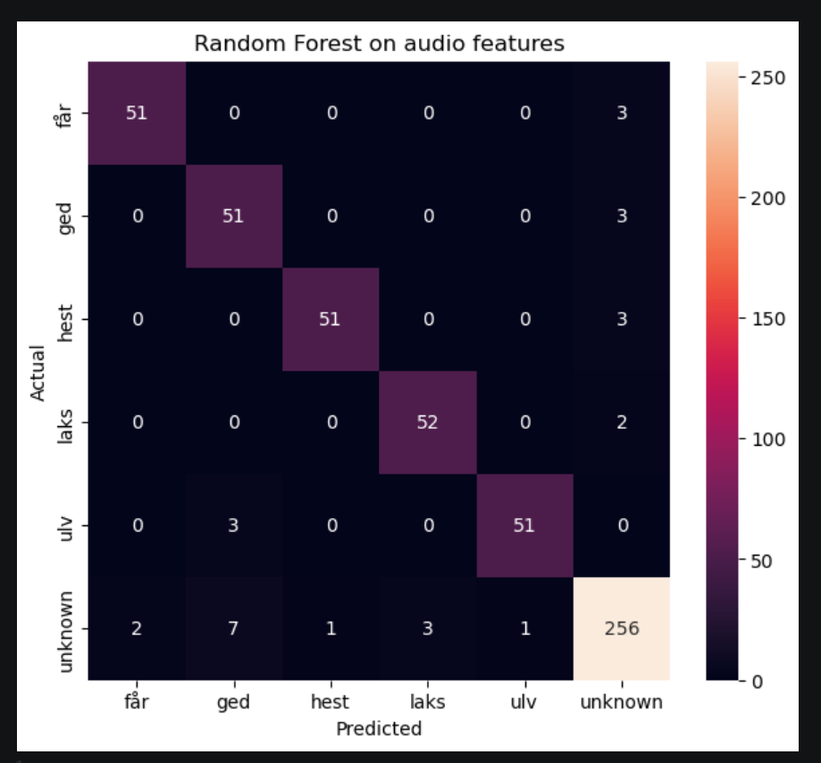

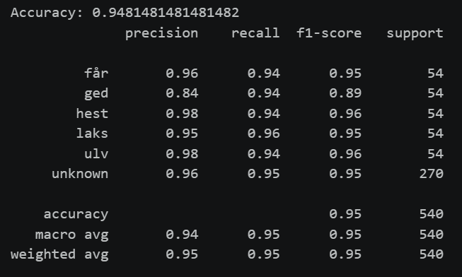

Altså, spørgsmålet er så om modellen faktisk kan generaliserer når man udtaler samme keywords i en anden dag, hvor udtalelsen har en anden energi, pr. person. 

##### "Extern split"
Hertil skiftede vi strategi, som går ud på at vi i stedet for at lave intern train/test split, så smed vi alt det data ind i en train. Dermed optog vi så en seperat test dataset i en anden dag, for at afspejle virkeligheden med at man skal kunne bruge produktet flere gange og i forskellgie dage. Altså at brugerne har forskellige energi i udtalelser, fra dag til dag, mm. 

Dertil afgrænsede vi også yderligere med at fokusere på 

Dette kalder vi for "tests" i repository strukturen, hvor "Intern" indeholdte intern train/test split. 

###### Dummy extern split med hurtige optagelser i TinyML klasse baggrundsstøj 

TEST DATASÆTTET ER BASERET PÅ 126 SAMPLES, SOM VI HURTIGT OPTOG I TinyML KLASSELOKALET. Hertil var der ikke kontrolleret ift. afstand og retningen af mikrofonen, samt at vi optog i selve klasselokalet, hvortil vi med datacuration blot lagde stille keyword optagelser ovenpå seperat målt TinyML klasse baggrundsstøj. 

Hertil brugte vi denne train/test split:
Train: 1800 samples, baseret på det samlede datasæt som set i "Intern Split"
Test: 126 samples

Det gav nedenstående confusion matrix eksempler:

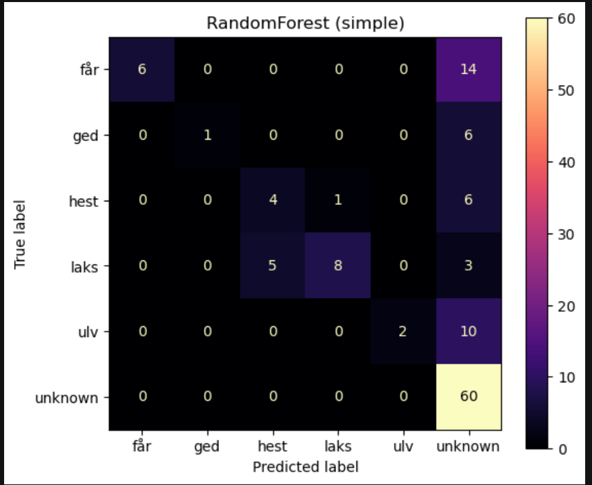

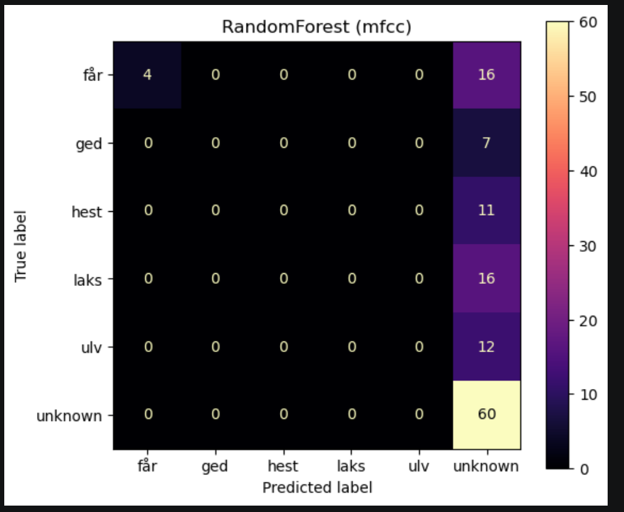

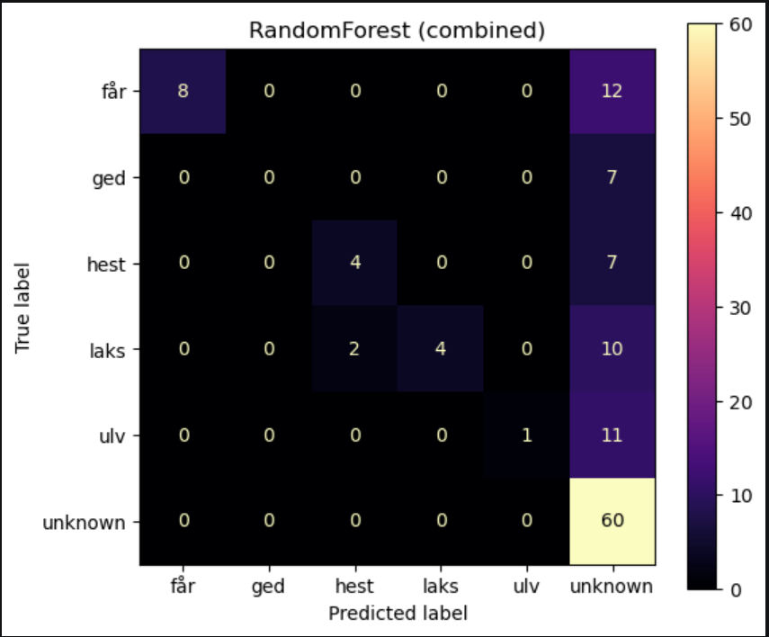

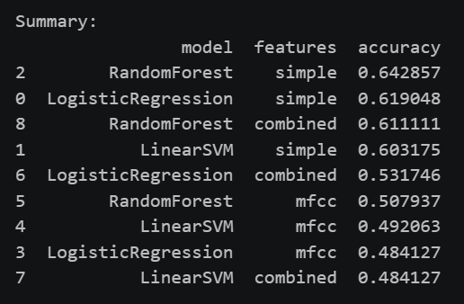

Ovenstående test data er fra tmlKlassen, hvilket vores optagelser med keywords ikke er robust for. Siden vi kun har optaget vores keywords i bachelor lokalet, så bør vi helst starte med at vores model er robust for bachelor lokalet eller en tilsvarende stille lokale. 

###### Test_tmlKlasse" - Extern test i stille TinyML lokale 

Hertil er strategien for dataopsamlingen vist således:

Train: 
- Keywords: 10 gentagelser * (3 speakers * 5 ord * 2 afstande) = 300
- Unknown: 80% random tale og 20% stilhed --> Bruger samme optagelser som vi gjorde første gang, men vi øger mængden af data indeholdende random tale og mindsker mængden af stilhed, for at vores model ikke bliver trænet på for meget stilhed. 
    - 60 stilheds samples fra bachelorlokale
    - 240 random ord samples fra bachelorlokale

Test:
- Keywords: 3 gentagelser * (3 speakers * 5 ord * 2 afstande) = 90
- Unknown: 50% random tale og 50% stilhed i TinyML klasselokalet 
    - 20 stilheds samples
    - 20 random ord

Støjmiljøet er stille, men selve rummet blev rykket op fra bachelorlokalet til Tiny Machine Learning klasse lokalet, hvor der ikke var andre folk til stede end os 3. 

Forskellen i lydkvalitet denne her dag er så at mikrofonoptagelserne bestod af mange kliklyde. Derudover er der også domæne skift akustisk mæssigt, hvilket højst sandsynligt er årsag til mange false negatives, som vist i nedenstående CM's:

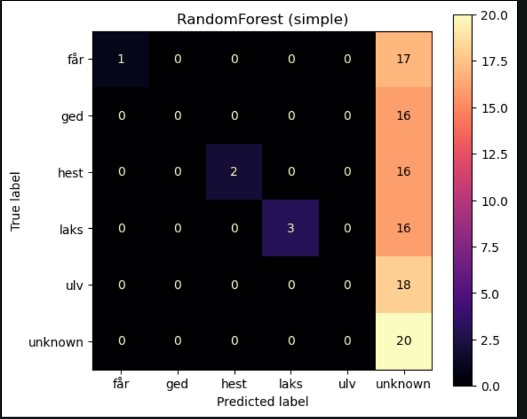

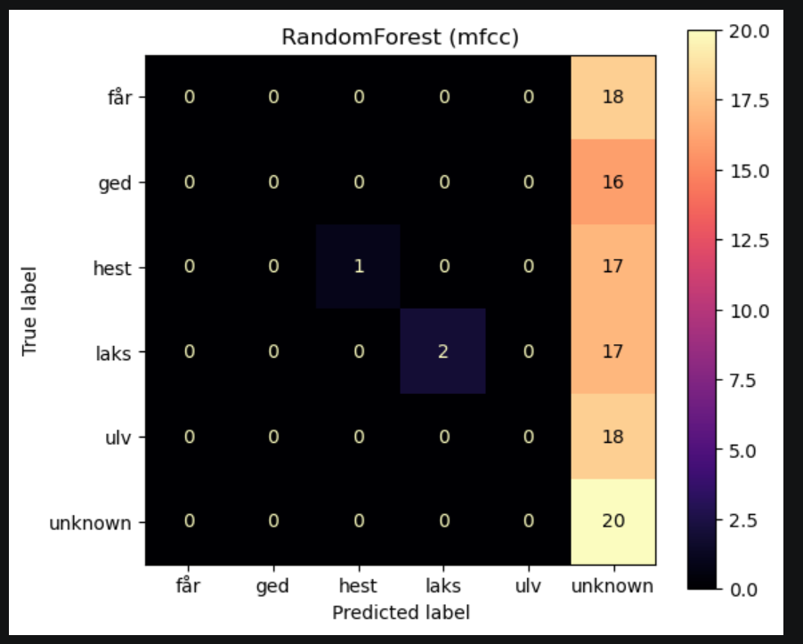

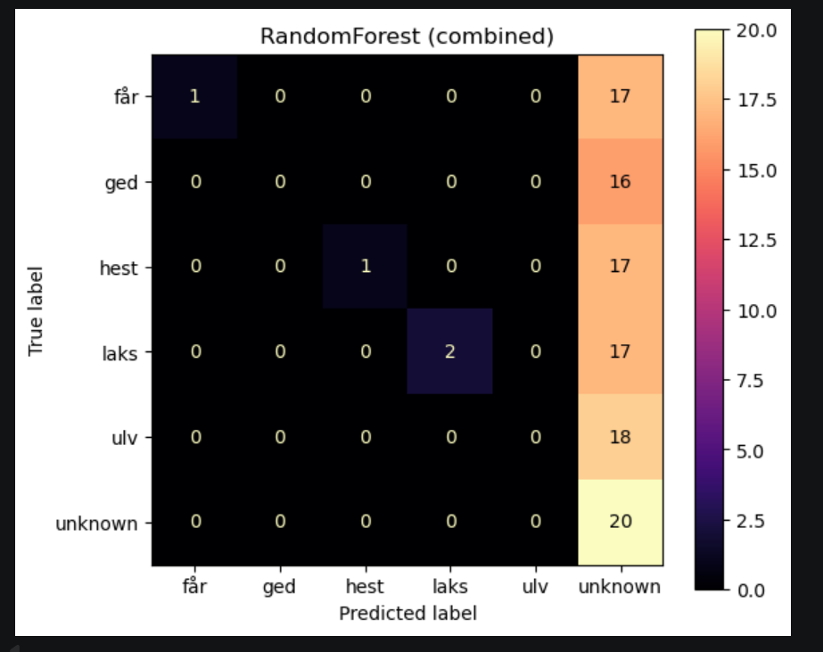

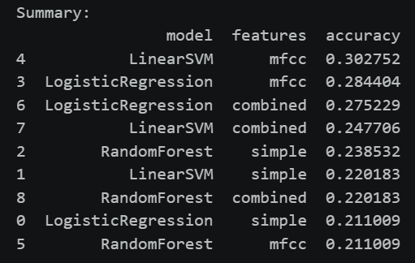

###### "Test_Chjem" - Extern test i stille og kontrolleret miljø, uden klik og muligt for stor domæneskift (Endelig afgrænsing)

Derfor optog Christian hjemme hos ham selv, hvor akustikken minder mere om bachelor-lokalet, samt at der ikke kan være f.eks. ventilationssystemer eller andet, som påvirker til støj i mikrofonoptagelserne. 

Hertil er strategien for dataopsamlingen vist således:

Train: 
- Keywords: 10 gentagelser * (3 speakers * 5 ord * 2 afstande) = 300
- Unknown: 80% random tale og 20% stilhed --> Bruger samme optagelser som vi gjorde første gang, men vi øger mængden af data indeholdende random tale og mindsker mængden af stilhed, for at vores model ikke bliver trænet på for meget stilhed. 
    - 60 stilheds samples fra bachelorlokale
    - 240 random ord samples fra bachelorlokale

Test:
- Keywords: 10 gentagelser * (1 speaker (C) * 5 ord * 2 afstande) = 100 samples
- Unknown: 25% random tale og 75% stilhed hos Christians værelse. 
    - 30 stilheds samples
    - 10 random ord

Det er svarende til train/test split på ca. 75/25, baseret på de antal samples i hver. 

Her fik vi flere true positives og negatives, som vist nedenunder:

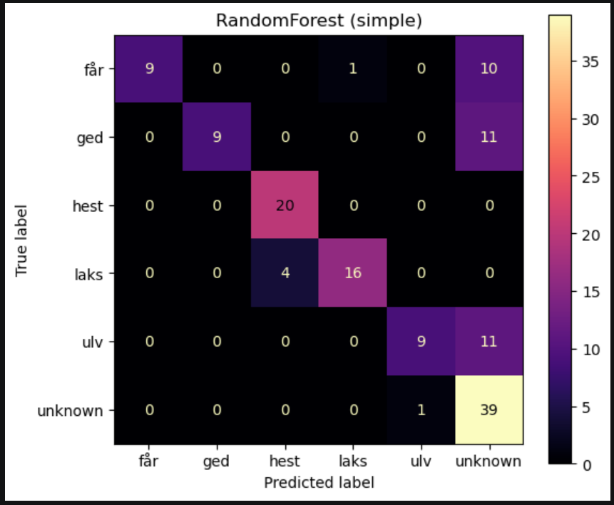

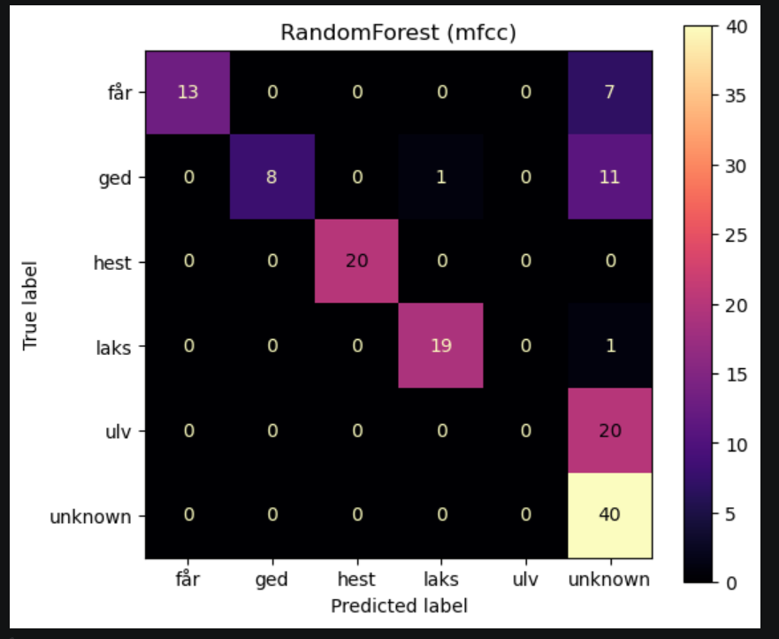

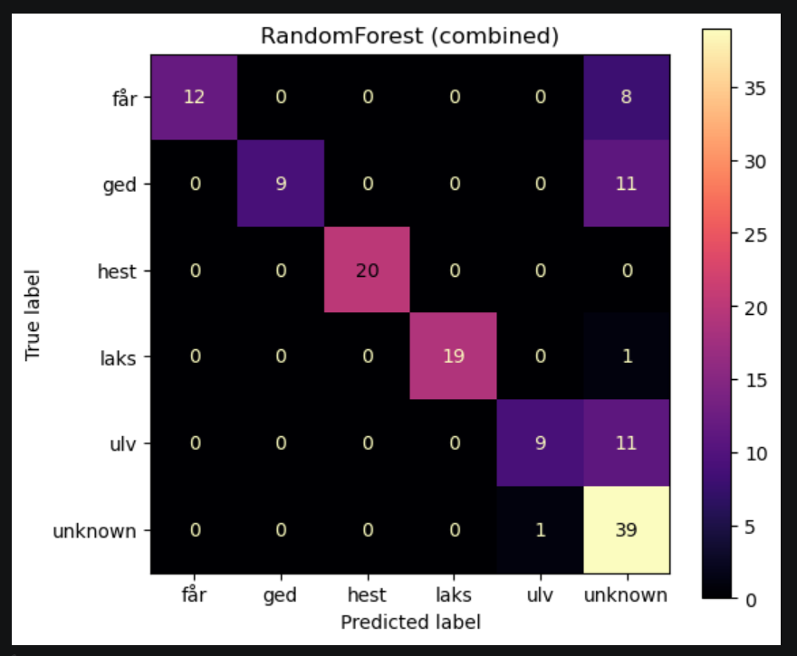

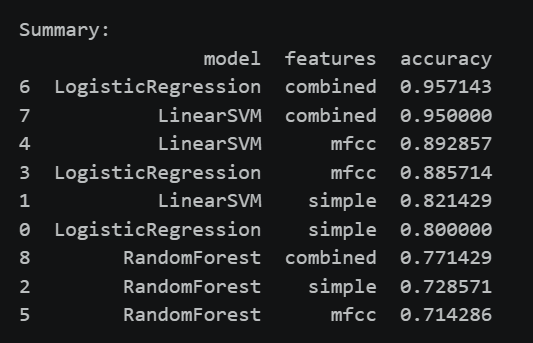

Hvilket skyldes at det er i et mere kontrolleret miljø. Dermed er det vores afgrænsning af projektets dataindsamling. 

Hertil er det vigtigt at bemærke at i disse afgrænsninger er der ikke ændret features, mm. undervejs, så der er umiddelbart variabelkontrol, udover forskellige datasæt, samt også forskellige train test størrelser af disse. 

#### Server
NEDENUNDER OPDATERES SÅ DET MATCHER VORES OPSAMLING MED TCP SERVER

Run the Photon 2 with the firmware in `firmware/data_photon`.  
It captures 10‑second audio clips and streams them over TCP to your PC running:

```bash
cd server
node server.js
```
Then type in terminal:
```
START dronename_dronemovement
STOP
```
Each session is automatically saved as a `.wav` file under `/data/recordings_drone/` or `/data/recordings_not_drone/`.

#### Audio splicing scripts med Python
BESKRIV PYTHON SCRIPTS TIL SPLICING
BESKRIV Audio Splicing scripts (Christian)

### 2. Traditionel Machine Learning Model

#### 2.1. Feature Extraction
Extract features compatible with the embedded model:
```bash
cd python
python feature_extract_v3.py --in_drones ../Data/recordings_drone --in_noise ../Data/recordings_not_drone --out ../csv_files/features_v3.csv
```

Features: `[zcr, spectral_centroid, spectral_rolloff, spectral_bandwidth, mfcc_1..mfcc_6]`  
Sampling rate: **16 kHz**, window size: **1.0 s**, hop: **0.5 s**.

#### 2.2. Model Training
Train a balanced Random Forest and export to C++:
```bash
python combine_and_train_v3.py --csv ../csv_files/features_v3.csv --out ../firmware/model_v3.h
```
Outputs:
- `model_v3.pkl` (Python model)
- `model_v3_meta.json` (metadata)
- `model_v3.h` (C++ header for Photon 2)

### 2.3. Embedded Deployment
Copy `model_v3.h` into `/firmware/drone_detection_live_photon/`  
This firmware runs the same feature extraction and real-time inference on the Photon 2.  
Predictions are sent via TCP to your PC.

### 2.4. Real-time Monitoring
Run the live viewer:
```bash
cd server
node server_live.js
```
Example output:
```
17:30:10 → noise | ZCR=0.174 | Cent=415Hz | Roll=1004Hz | BW=512Hz
17:30:30 → X | ZCR=0.378 | Cent=2191Hz | Roll=6352Hz | BW=1032Hz
🚁 Drone activity detected: X
```
### 3. Deep Learning Model

TBA

---


## Authors
**Christian Rex Rønfeldt Brandt Pilegaard, 6. semester - Diplomingeniør i Eleketronik studerende**

Tiny Machine Learning (ETTML) Projekt — Aarhus Universitet
